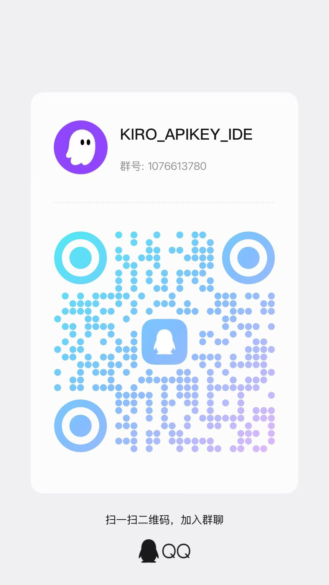

<p align="center">
  
</p>

<h1 align="center">KIRO-APIKEY-IDE</h1>

<p align="center">
  <strong>用 Kiro API Key（<code>ksk_</code>）直接在 Kiro 自带对话框里选择模型聊天</strong>
</p>

<p align="center">
  API Key 直连 · 多密钥管理 · 自动故障转移 · 账户积分同步 · 连通性测试 · 一键接管
</p>

<p align="center">
  
  
  
  
  
</p>

<p align="center">
  ⚠️ 本拓展纯免费・KIRO 官方直连・发现中转・赔款一万元
</p>

<p align="center">
  📖 <a href="CHANGELOG.md">更新日志</a>
  ｜ 📦 <a href="https://github.com/lucks-cloud/kiro-apikey-ide/releases">下载最新版本</a>
</p>

---

## ✨ 功能特性

### 🔑 API Key 直连

- 用 `ksk_` 密钥直连 Kiro 官方网关，Kiro 自带对话框即走你的 key，额度按 key 计费
- 不借助任何第三方服务器、外部依赖，无需安装额外软件
- 本地双代理：`KRS`（AI 生成面）/ `CPS`（模型、用量控制面），端口可在设置中调整

### 🗝️ 多密钥管理

- 添加多个密钥，请求按顺序自动故障转移（失败切换下一个）
- 快捷搜索定位，正在使用的密钥自动置顶并标注绿色「当前」标签
- 批量导入（一行一个，自动去重校验）、批量导出（txt，可选保存位置）、批量删除（默认全选，锁定正在使用的 key 防误删）
- 右键复制完整密钥、单独同步账户信息、删除

### 🔄 账户信息同步

- 自动刷新每个密钥的订阅类型与积分用量（已用 / 总额），并按密钥持久缓存
- 支持单个 / 批量同步，分批并发，展示最近同步时间
- 同步失败保留已有有效数据，不会短暂清空或覆盖

### 🧪 连通性测试

- 一键检测密钥可用性，展示订阅信息、积分用量与可用模型列表
- 明确提示：测试通过仅代表 Key 有效，实际能否对话需开启网关并切换到该 Key 后实测

### 🚪 网关总开关

- 一键开启 / 关闭接管，关闭即无缝切回 Kiro 官方服务
- 端点写入后回读校验、健康检查通过再覆盖、端口冲突检测，确保真正生效

### 🌍 地区配置

- 支持切换密钥所属 Region（默认 `us-east-1`，可选其它区域或自定义）

### 🧾 运行日志

- 面板内置日志抽屉，可查看、刷新、复制最近一小时运行日志
- `KRS` / `CPS` 代理链路首次收到请求时输出醒目标记，快速区分「未走代理」与「代理已通但上游报错」

---

## 📥 安装

先从 [Releases](https://github.com/lucks-cloud/kiro-apikey-ide/releases) 下载最新的 `kiro-apikey-ide-<version>.vsix`，然后用以下任意一种方式安装到 Kiro IDE：

- **拖入安装**：直接把 `.vsix` 文件拖到 Kiro IDE 左侧的「扩展」面板中。
- **菜单安装**：打开「扩展」面板，点右上角的 **⋯（三个点）** →「从 VSIX 安装…」，选择下载好的 `.vsix` 文件。

安装完成后如提示重新加载，点「重新加载窗口」即可。

## 🚀 如何使用

1. 打开侧边栏的 **KIRO-APIKEY-IDE** 图标进入面板。
2. 点右上角「添加」，粘贴你的 API Key（`ksk_` 开头），点确定。可添加多个，多个 key 会按顺序自动故障转移。
3. 选择 **Region**（默认 `us-east-1`；如果你的 key 属于其它区域，选对应区域或自定义）。
4. 打开「网关开关」。首次启用会提示重新加载窗口——点「重新加载窗口」使其生效。
5. 回到 Kiro 自带对话框，在模型选择里挑一个模型开始聊天，额度走你的 key。

### 常用操作

- 每个密钥右侧「测试」：弹窗显示该 Key 连通性结果，并列出可用模型。
- 「删除」：二次确认后移除该密钥。
- 关闭「网关开关」：即切回 Kiro 官方服务，重新加载窗口后生效。

### 提示

- 需要 Kiro 处于已登录状态，插件会用你的 API Key 替换实际请求的凭证。
- 请妥善保管你的 API Key。
- 本插件纯免费，开发不易，不提供免费人工咨询答疑服务。如确需技术人员协助，可进入交流群联系群主。注：协助服务 50 元/次，未解决好全额退款！

---

## ❓ 常见问题

> 以下问题同样可在插件面板底部的「常见问题」中展开查看。

**KIRO-APIKEY-IDE 的作用是什么？**
使用 Kiro API Key（`ksk_`）直接在 Kiro 自带的对话框里选择模型聊天、完成代码任务。不借助任何第三方服务器、外部依赖，无需安装额外软件。

**什么是 API Key？**
Kiro API Key 是 Kiro（Amazon Q 旗下 AI 编程助手）的“程序密码”，用来在脚本、CI/CD、容器里免登录、无交互调用 Kiro CLI / API，不用每次都弹浏览器登录。

**如何获取 API Key？**
可以在 KIRO 官网账户后台获取 API Key，也可以在任意其他渠道购买获取。

**如何判断是否连接成功？**
选择有效 key 后，开启网关开关。重载窗口后查看 KIRO IDE 右下角积分是否与当前 key 的积分一致。若一致代表连接成功。

**测试 API Key 有效，但无法进行对话？**
API Key 测试连通性显示正常，说明当前 API Key 是有效的。可排查网络故障、是否安装其他类似插件造成冲突等问题。也可以在日志查询功能中查看 `[KRS]`、`[CPS]` 端口是否正常启用，以及 `[CPS]` 的 kiro-agent 代理请求链路是否已打通。最后，可以使用 [KIRO CLI](https://kiro.dev/cli/) 进行准确连通测试。

**需要人工服务？**
本插件纯免费，开发不易，不提供免费人工咨询答疑服务。如您确需要技术人员为您提供帮助，可进入交流群联系群主。注：协助服务 50 元/次，未解决好全额退款！

---

## 🛠️ 技术栈

| 层 | 选型 |
| --- | --- |
| 扩展主进程 | Node.js（VS Code Extension API） |
| 面板前端 | Vue 3 |
| UI 组件 | Ant Design Vue 4 |
| 状态管理 | Pinia |
| 构建工具 | Vite |

---

## 🚧 开发

```bash
# 构建 webview 面板（会自动安装 webview-ui 依赖）
npm run build:webview

# 构建并打包为 .vsix
npm run package
```

打包产物为 `kiro-apikey-ide-<version>.vsix`。推送 `v*` 标签会通过 GitHub Actions 自动构建并发布到 [Releases](https://github.com/lucks-cloud/kiro-apikey-ide/releases)。

---

## 🔖 更新日志

各版本变更记录见 [CHANGELOG.md](CHANGELOG.md)，当前版本 v1.0.13。

---

## 💬 交流群（添加请备注 KIRO）

<p align="center">
  
</p>

- QQ 群：1076613780

---

## 🙏 许可

- 作者：[lucks-cloud](https://github.com/lucks-cloud)
- 许可：[AGPL-3.0](LICENSE)（或更新版本）
- Kiro 官网：<https://kiro.dev>
